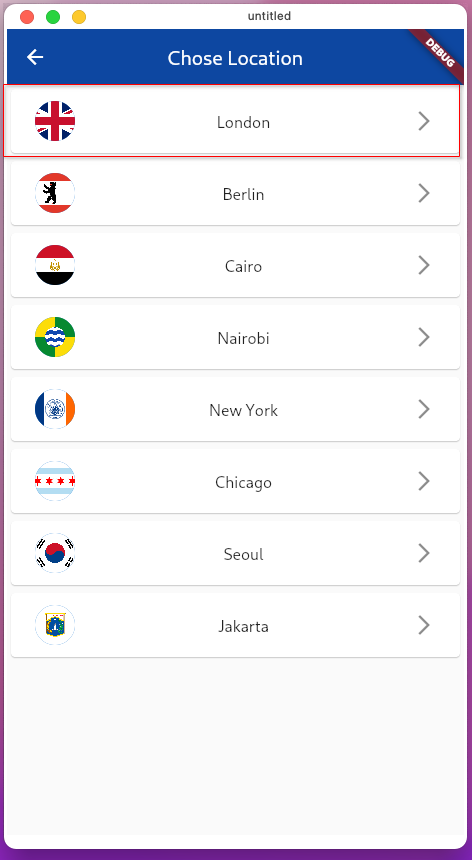

# Time_location with Flutter
> this mobile application can tell you the time in different location or cities around the world

 <h1 align="center">
   
 
 
   
  Home Page
</h1>

 <h1 align="center">
   
 
   
  Locaiton Page
</h1>

# Demonstration video

https://user-images.githubusercontent.com/71181493/213521947-bca00ff2-5d1a-4cb2-8e1d-9241dce41116.mp4

## Getting Started

This project is a starting point for a Flutter application.

A few resources to get you started if this is your first Flutter project:

- [Lab: Write your first Flutter app](https://docs.flutter.dev/get-started/codelab)
- [Cookbook: Useful Flutter samples](https://docs.flutter.dev/cookbook)

For help getting started with Flutter development, view the
[online documentation](https://docs.flutter.dev/), which offers tutorials,
samples, guidance on mobile development, and a full API reference.
